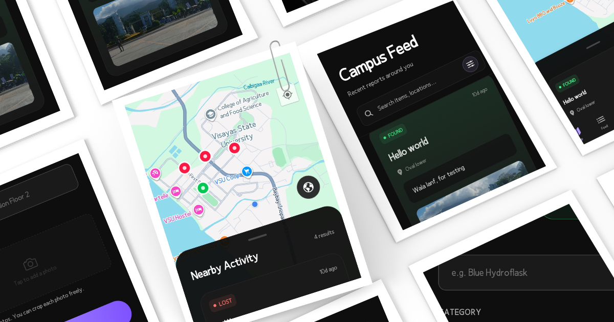
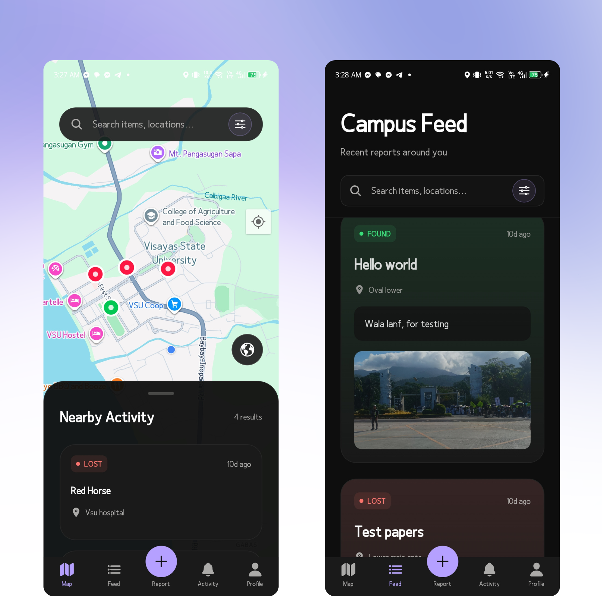
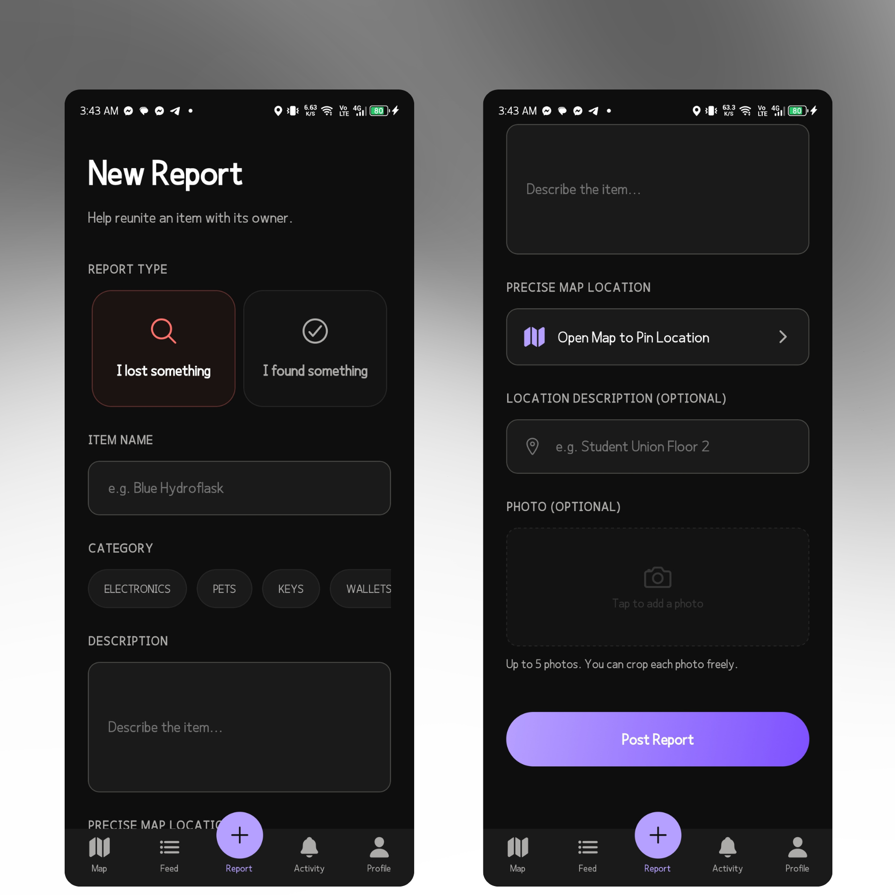
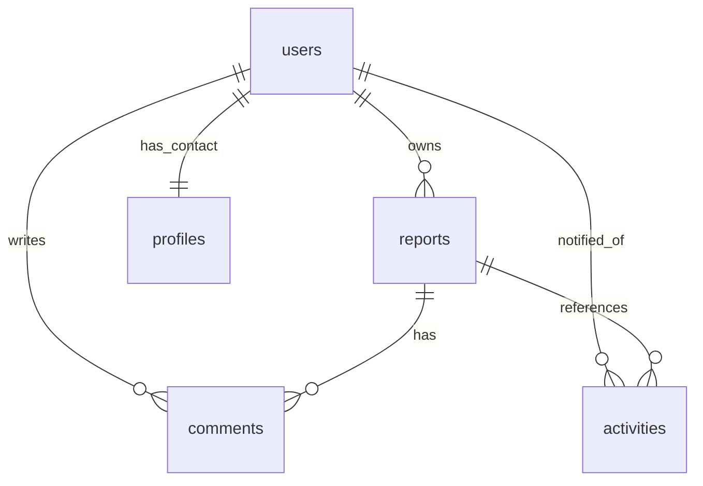

# VSeekr 🔍

A premium, community-driven **lost and found mobile application** designed for campuses and local communities. VSeekr empowers individuals to report lost or found items on a fully interactive map, coordinate with finders in real time, and receive instant push notifications — all inside a stunning, modern dark-mode experience.

Built with **Expo (React Native)** and powered by **Supabase**.

---

## 📸 Screenshots & Media

<p align="center">
  
</p>

<p align="center">
  
  &nbsp;&nbsp;&nbsp;&nbsp;&nbsp;&nbsp;&nbsp;&nbsp;
  
</p>

---

## 🚀 Features

### 🗺️ Interactive Maps
* **Live Google Maps:** Pins are color-coded based on report type: 🔴 **Lost** and 🟢 **Found**.
* **Precise Location Picker:** Select custom coordinates via an interactive map modal when creating a report.
* **Proximity Map Feed:** A sliding bottom sheet that lists items near you immediately.
* **Map & Search Filters:** Filter items dynamically by keywords, map views, type, and categories (Electronics, Apparel, Pets, etc.).

### 💬 Instant Real-Time Comments
* **Chat-Style Bubbles:** Sleek bubbles with distinct visual styles differentiating your comments from others.
* **Optimistic UI Updates:** Comments appear **instantly** when sent. Network operations, RLS logs, and push notification dispatches run silently in the background, offering zero-lag UX.
* **Fail-Safe Rollback:** Automatic text recovery in the input bar if network transactions fail.

### 🔔 Activity Screen & Real-Time Sync
* **Interactive Logs:** Displays notifications for activities on your own items (such as "Someone commented on your report").
* **Push Notifications:** Deep integration with Expo Push Notification Service.
* **In-App Toasts:** Slides down instantly in the foreground to notify you of activity updates across tabs.
* **Direct Deep Linking:** Tap any local toast or system-level notification to navigate instantly to the target report details screen.

### 👤 Profile & User Customization
* **Contact Information:** Store and update your default name, email, and phone number to automatically share with others when you post a **Found** item.
* **Personal Statistics:** Track active lost/found items submitted.

### 🤖 Smart AI Matching & Moderation
* **AI Image Recognition:** Powered by Google Gemini via Edge Functions. When an item is found, the AI actively compares its images against lost reports, instantly notifying owners if there's a visual match!
* **Community Moderation:** Users can seamlessly report suspicious posts or comments.
* **Admin Dashboard:** Dedicated in-app hub for admins to review the moderation queue, verify violations, and promote users.
* **Automated Strikes System:** 5 confirmed violations lead to an automatic, system-enforced account ban.

---

## 🛠️ Tech Stack

| Domain | Technology |
|---|---|
| **Core Framework** | Expo SDK 54 / React Native 0.81 (New Architecture Enabled) |
| **Routing & Navigation** | Expo Router v6 (File-based navigation) |
| **Backend & Database** | Supabase (Postgres, Realtime engine, JWT Auth, Object Storage) |
| **Serverless Integration** | Supabase Edge Functions (Deno Deploy) |
| **AI Integration** | Google Gemini API (`gemini-1.5-flash`) |
| **Maps & Geolocations** | `react-native-maps` with Google Maps SDK |
| **Push Notifications** | `expo-notifications` + Expo Push Notification service |
| **Local Persistence** | `@react-native-async-storage/async-storage` |
| **Interface Styling** | Premium HSL tailormade colors, Glassmorphism, and Outfit Typography |

---

## 📂 Project Structure

```text
vseekr/
├── .expo/                   # Expo local build cache
├── app/                     # File-based router folder (Expo Router)
│   ├── _layout.tsx          # Root entry point, providers, safe areas, navigation root
│   ├── index.tsx            # Navigation gateway / Session validator redirect
│   ├── (auth)/              # Authentication Stack
│   │   ├── login.tsx        # Sign In Screen
│   │   ├── register.tsx     # Sign Up Screen
│   │   ├── forgot-password.tsx  # Request password reset screen
│   │   └── update-password.tsx  # Set new password screen
│   ├── (tabs)/              # Core Application Bottom Tabs
│   │   ├── index.tsx        # Map View & Bottom Sheet List Screen
│   │   ├── feed.tsx         # Chronological list scroll-feed
│   │   ├── index.tsx        # Create report screen
│   │   ├── activity.tsx     # Notifications feed
│   │   └── profile.tsx      # User statistics & profile editor
│   └── details/
│       └── [id].tsx         # Dynamic report detail with map, details, and comments
├── assets/
│   └── images/              # Cleaned active logos and icons
├── components/              # Shared Layout & Design System Components
│   ├── Map.tsx              # Geolocations native Google Map wrapper
│   ├── ReportItem.tsx       # Reusable report list-card
│   └── ui/                  # Atom-level UI (Button, Card, Typography, etc.)
├── lib/                     # Global Libraries and Context Hooks
│   ├── supabase.ts          # Supabase client instantiation
│   ├── AuthProvider.tsx     # Active session context provider
│   ├── NotificationProvider.tsx  # In-app toasts & Native push notifications listener
│   └── constants.ts         # Categories & system constants
└── supabase/                # Live Database Configuration
    └── functions/           # Deno Edge Functions
        └── send-push/       # Push Notification dispatcher script
```

---

## 🗄️ Database Schema

VSeekr operates on a PostgreSQL schema secured behind strict **Row Level Security (RLS)**. The `anon` role is completely blocked; all read/write actions require an authenticated user JWT.

### Database Tables Diagram



### Table Definitions

#### 1. `public.users`
* `id` (`uuid`, Primary Key, references `auth.users.id`)
* `username` (`text`, unique)
* `avatar_url` (`text`, nullable)
* `points` (`integer`, default `0`)
* `created_at` (`timestamp with time zone`)

#### 2. `public.reports`
* `id` (`uuid`, Primary Key)
* `user_id` (`uuid`, Foreign Key references `users.id`)
* `type` (`USER-DEFINED` - `'lost'` or `'found'`)
* `category` (`USER-DEFINED`)
* `status` (`USER-DEFINED` - `'active'` or `'closed'`)
* `item_name` (`text`)
* `description` (`text`)
* `location_name` (`text`)
* `latitude` (`double precision`)
* `longitude` (`double precision`)
* `image_urls` (`ARRAY` of `text`)
* `created_at` (`timestamp with time zone`)

#### 3. `public.comments`
* `id` (`uuid`, Primary Key)
* `report_id` (`uuid`, Foreign Key references `reports.id` on delete cascade)
* `user_id` (`uuid`, Foreign Key references `users.id`)
* `content` (`text`)
* `created_at` (`timestamp with time zone`)

#### 4. `public.activities`
* `id` (`uuid`, Primary Key)
* `user_id` (`uuid`, Foreign Key references `users.id` on delete cascade) — Recipient user
* `action_type` (`USER-DEFINED` - `'created_report'`, `'resolved_report'`, `'commented'`, `'nearby_report'`)
* `target_report_id` (`uuid`, Foreign Key references `reports.id` on delete cascade)
* `created_at` (`timestamp with time zone`)

#### 5. `public.profiles`
* `id` (`uuid`, Primary Key, references `users.id` on delete cascade)
* `contact_name` (`text`, nullable)
* `contact_phone` (`text`, nullable)
* `contact_email` (`text`, nullable)
* `expo_push_token` (`text`, nullable)

---

## 🏁 Getting Started

### Prerequisites
* [Node.js](https://nodejs.org/) (LTS recommended)
* [EAS CLI](https://docs.expo.dev/build/setup/) (`npm install -g eas-cli`)
* A Google Maps API key (for iOS/Android map SDKs)
* A running Supabase instance

### Environment Variables Setup
Create a `.env` file in the root of the project:

```env
EXPO_PUBLIC_SUPABASE_URL=https://your-project.supabase.co
EXPO_PUBLIC_SUPABASE_ANON_KEY=your-anon-public-key
EXPO_PUBLIC_GOOGLE_MAPS_API_KEY=your-google-maps-api-key

# Required for Edge Functions (Deploy via Supabase CLI/Dashboard)
GEMINI_API_KEY=your-google-gemini-api-key
```

### Installation

```bash
# Clone the repository
git clone https://github.com/JakeNLelis/VSeekr.git
cd vseekr

# Install all dependencies
npm install
```

---

## 📜 Available Scripts

Inside the project folder, you can run several scripts to develop, optimize, and test the app:

| Command | Action |
|---|---|
| `npm run start` / `npx expo start` | Starts the Expo Metro Bundler. |
| `npx expo start -c` | Starts the bundler and clears the system build cache. |
| `npm run android` | Starts the bundler and runs the app on an Android emulator/device. |
| `npm run ios` | Starts the bundler and runs the app on an iOS simulator/device. |
| `npx expo-optimize` | Compresses and optimizes asset images to reduce binary bundle size. |
| `npx expo lint` | Automatically scans your code for style and syntax issues. |

---

## 🚀 Deployment & Builds

### Build a Standalone Android APK (`.apk`)
To compile a production-ready, standalone Android APK file for direct installation (without publishing to the Google Play Store):

```bash
# Start the EAS production build via the preview profile
eas build --platform android --profile preview
```

To compile the APK entirely on your own local environment (Android Studio + Java required) and bypass queue waiting:

```bash
eas build --platform android --profile preview --local
```

### Publishing a GitHub Release
When publishing a release on GitHub:
1. Compile your production APK using the `preview` profile.
2. Tag your commit: `git tag -a v1.0.0 -m "Release v1.0.0" && git push origin v1.0.0`
3. Create a new release in your GitHub repository sidebar under the `v1.0.0` tag.
4. Drag and drop the downloaded `.apk` installer file directly into the release assets card so anyone can download it immediately!

---

## ✍️ Authors, Policies & License

* **Lead Architect:** [JakeNLelis](https://github.com/JakeNLelis)
* **Privacy Policy:** Read how we protect your data in our [Privacy Policy](privacy_policy.md).
* Licensed under the MIT License — see the [LICENSE](LICENSE) file for details.
